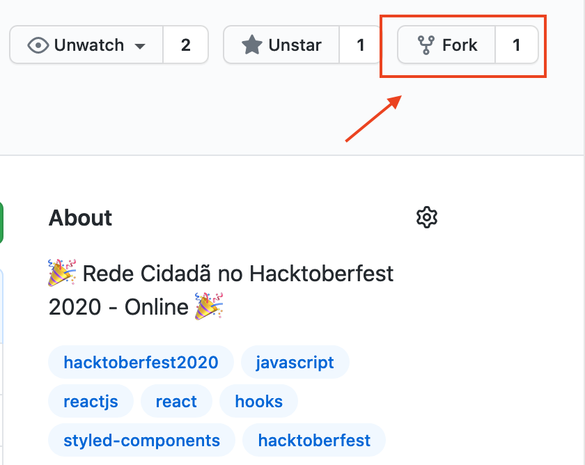
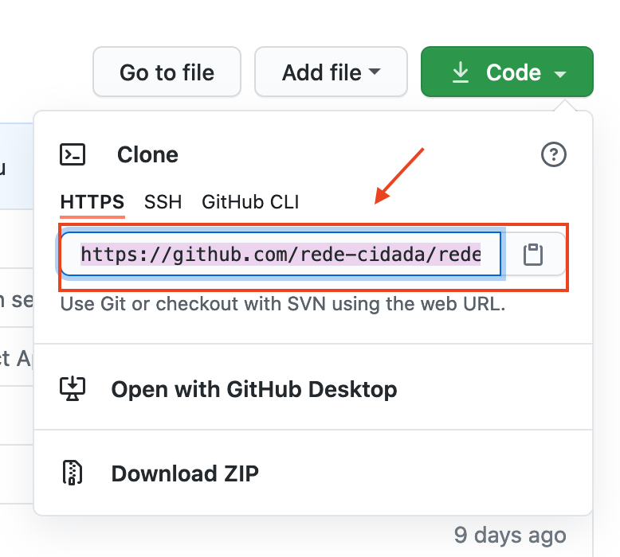
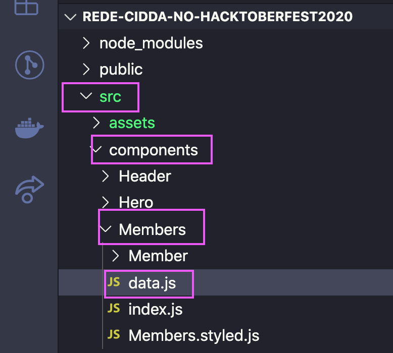
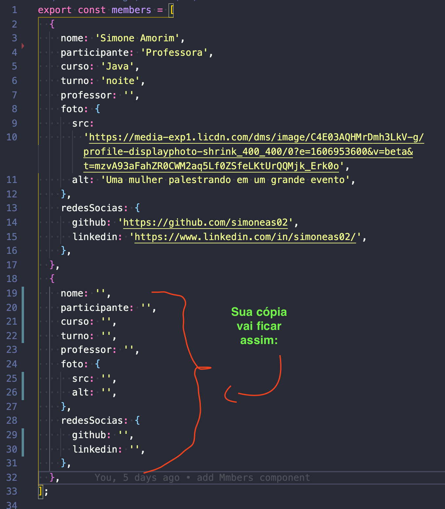
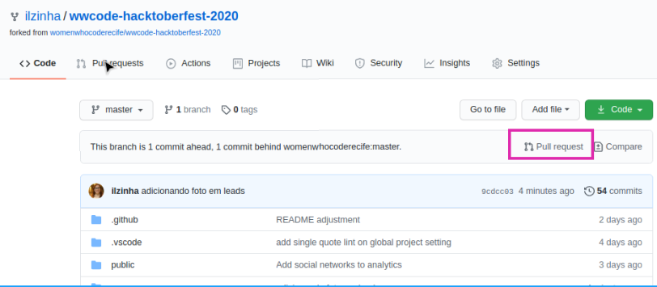

# Como contribuir?

> Para ter sucesso na sua contribuição siga o nosso passo a passo que vai desde a configuração inicial... a solicitação do último pull request 🏆

- [Como contribuir?](#como-contribuir)
  - [Configurando sua área de trabalho](#configurando-sua-área-de-trabalho)
  - [Contribuindo](#contribuindo)
    - [Antes de começar!👩🏿‍💻👩🏻‍💻👩🏽‍💻👩🏾‍💻👩🏼‍💻](#antes-de-começar)
    - [Agora vamos contribuir!](#agora-vamos-contribuir)
    - [1º Pull request](#1º-pull-request)
    - [2º Pull request](#2º-pull-request)
    - [3º Pull request](#3º-pull-request)
    - [4º Pull request](#4º-pull-request)

## Configurando sua área de trabalho

Garanta que já tem o VSCode e a lista abaixo devidamente instalada na sua máquina, uma ótima maneira de descobrir é digitando os comandos abaixo no seu terminal:

```bash
node -v
git --version
yarn -v
```

Caso você não tenha algumas das ferramentas acima instaladas acesse os links abaixo para baixá-las para sua máquina e faça a instalação.

1. 🔽 [VSCode](https://code.visualstudio.com/)
2. 🔽 [Node](https://nodejs.org/en/)
3. 🔽 [Git](https://git-scm.com/)
4. 🔽 [Yarn](https://classic.yarnpkg.com/pt-BR/docs/install)

---

## Contribuindo

### Antes de começar!👩🏿‍💻👩🏻‍💻👩🏽‍💻👩🏾‍💻👩🏼‍💻

1. ✨ Você precisa fazer um fork [desse repositório](https://github.com/rede-cidada/rede-cidada-no-hacktoberfest2020).  
   ⚠️ Clicando em `Fork` você irá criar uma cópia do repositório para sua conta no `Github`  
   

2. ✨ Você precisa fazer um clone do seu repositório que foi forkado.  
   

3. ✨ Pelo seu terminal, vá até a área de trabalho e execute o comando abaixo, mas antes troque o texto `SEU_USER` pelo seu usuário do Github ou você pode copiar a `URL` no local indicado na imagem anterior.
   ```bash
      git clone https://github.com/SEU_USER/rede-cidada-no-hacktoberfest2020.git
      cd rede-cidada-no-hacktoberfest2020 && yarn install && yarn start
   ```
4. ✨ Se você não for direcionado automaticamente para a aplicação, vá no seu navegador web e acesse: `http://localhost:3000/`

---

### Agora vamos contribuir!

Ainda no terminal, tenha certeza que você está dentro da página do projeto que você acabou de clonar e execute `code .`

✨Você será direcionado para o Visual Studio Code e lá deve conter a estrutura abaixo:  
 

✨Vá para `src` -> `components` -> `Members` -> `data.js` , esse será o arquivo que vamos utilizar para fazer nossas PRs.

✨Observe que o arquivo `data.js` tem um array `members` com apenas um objeto como exemplo, primeiramente você vai copiá-lo e colar essa cópia logo abaixo dele, depois apague todas as informações para deixá-lo no formato da imagem abaixo:


### 1º Pull request

✨ Bora fazer adicionar alguma informação nesse novo objeto que você fez uma cópia, e depois já podemos enviar nossa primeira PR.

1. No campo `nome` você irá inserir o seu nome
2. No campo `participante` você irá preencher com apenas uma das seguintes opções:
   1. Aluno
   2. Professor
   3. Convidado
3. No aquivo que você fez a alteração, aperte `Ctrl + s` para salvar.
4. Vá para o terminal e dentro da pasta do projeto execute os comandos abaixo, atenção: execute um comando por vez:
   ```bash
      git status
      git add .
      git commit -m "mensagem do commit com descrição"
   ```
5. Agora que fizemos o commit precisamos verificar se existe algo novo no repositório original (O da Rede Cidadã que você fez o fork), execute os comandos abaixo no seu terminal:
   ```bash
      git remote add upstream https://github.com/rede-cidada/rede-cidada-no-hacktoberfest2020.git
      git fetch upstream
      git pull upstream master
   ```
6. Após executar o ``pull` pode acontecer de ter gerado conflitos, pelo fato de ter outras pessoas alterando o mesmo arquivo no mesmo ponto que você, se esse for o seu caso, será necessário resolver os conflitos primeiro antes de subir suas atualizações, iremos realizar este passo durante o evento, caso não tenha gerado conflitos você pode pular para o passo 9.
7. Após resolver os conflitos você precisa commitar novamente suas alterações executando os mesmos comandos do passo 3 e 4
8. Execute o comando abaixo para se certificar que você já tem todas as alterações do repositório original. `git pull upstream master` a partir desse momento vira um loop entre os passos 6, 7 e 8, até voc6e se certificar que seu repositório já tem todas as informações do repositório original...
9. Agora sim você pode mandar suas informações para seu repositório remoto executando o comando abaixo.
   ```bash
     git push -u origin master
   ```
10. Agora vá para o repositório no seu Github e clique em `Pull request`
    
11. Note que a comparação dos repositórios é feita da direita para esquerda e que a branch master do seu repositório está sendo comparada com a branch master do repositório da Rede Cidadã.
    1. ✨ Quando aparece o "Able to merge", significa que não há conflitos entre os repositórios, então você pode adicionar uma mensagem para o pull request e seguir para o passo 12.
    2. ⚠️ Caso apareça uma mensagem de conflito (ela estará em vermelho), volte para o vscode e repita os comandos a partir do passo 8.
12. Clique em `Create pull request` e se tiver a mensagem `This branch has no conflicts with the base branch`, significa que sua `pull request` foi concluída com sucesso! ✅ PRONTO! Sua primeira pull request foi criada.

### 2º Pull request

**_ATENÇÃO_** Aguarde sua primeira `pull request` ser aprovada para poder enviar a segunda.

1. Volte para o vs code e preencha os campos abaixo do mesmo objeto que copiou na sua primeira `pull request`
   1. curso: seu curso no start, exemplo: Front-end, Java, Python...
   2. turno: o turno do seu curso: manhã, tarde ou noite
   3. professor: o nome do seu professor,
2. Agora você precisa realizar o commit e solicitar a sua segunda `pull request` no github., para isso siga os passos 3 e 4 da `1º Pull request` depois pule para o passo 8.

### 3º Pull request

**_ATENÇÃO_** Aguarde sua segunda `pull request` ser aprovada para poder enviar a terceira.

1. Volte para o vs code e preencha os campos abaixo no objeto `foto` do mesmo objeto que copiou na sua primeira `pull request`.
   1. src: coloque o link da foto do seu perfil do github
   2. alt: escreva uma pequena descrição da sua foto
2. Agora você precisa realizar o commit e solicitar a sua terceira `pull request` no github., para isso siga os passos 3 e 4 da `1º Pull request` depois pule para o passo 8.

### 4º Pull request

**_ATENÇÃO_** Aguarde sua terceira `pull request` ser aprovada para poder enviar a quarta.

1. Volte para o vs code e preencha os campos abaixo no objeto `redesSocias` do mesmo objeto que copiou na sua primeira `pull request`.
   1. github: coloque o link do seu github
   2. linkedin: coloque o link do seu linkedin
2. Agora você precisa realizar o commit e solicitar a sua terceira `pull request` no github., para isso siga os passos 3 e 4 da `1º Pull request` depois pule para o passo 8.

🏆 Feito!!
💟 Você completou as 4 Pull Requests e agora pode ir na página do Hacktoberfest para conferir!
